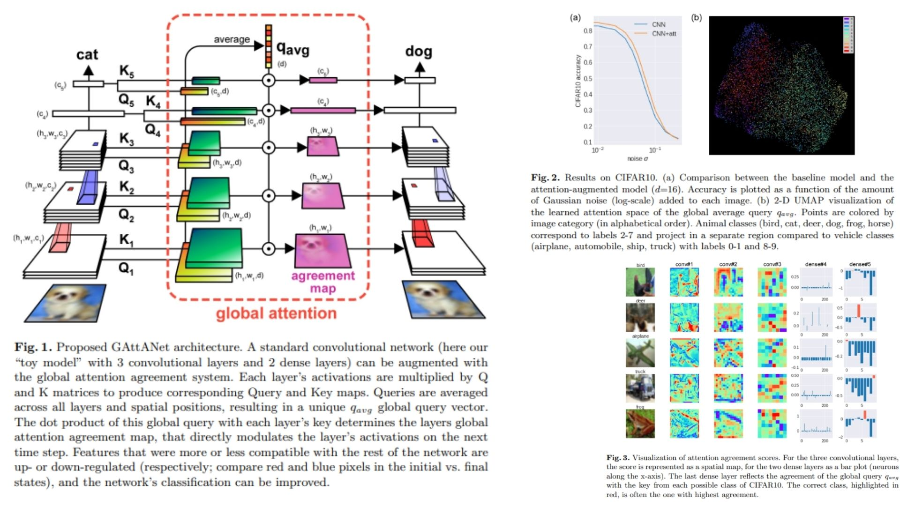

# 🧠 GAttANet-Replication – Global Attention Agreement for CNNs

This repository provides a **PyTorch-based replication** of  
**GAttANet: Global attention agreement for
convolutional neural networks**.

Focus: **implementing and understanding global attention agreement mechanisms** practically,  
without chasing SOTA benchmark results.

- Captures **layer-wide consensus for feature activations** 🔍  
- Modular & **plug-and-play with any CNN backbone** 🔗  
- Lightweight & interpretable, ideal for **experimentation and analysis** 🧩  

**Paper reference:** [VanRullen & Alamia, 2021](https://arxiv.org/abs/2104.05575) 📄

---

## 🌌 Overview – GAttANet Pipeline




> Each part of the network “votes” on what’s important.  
> A **global attention query** represents the network’s overall opinion.  
> Individual features are then **amplified or suppressed** depending on how well they agree with this global consensus—like how humans revise their opinion when comparing with the group.

High-level procedure:

1. Extract feature maps from selected CNN layers (convolutional & dense).  
2. Each spatial position (or neuron) produces a **key & query** vector:  
   $$k_i, q_i = \text{Linear/Conv projection of layer activations}$$
3. Compute **global query** by averaging all queries across layers:  
   $$q_\text{avg} = \frac{1}{N} \sum_\text{layers} \text{mean over space/units}(q)$$
4. Compute **agreement score** for each feature with the global query:  
   $$gatta_i = k_i \cdot q_\text{avg}$$
5. **Modulate activations** based on agreement:  
   $$x_i' = x_i \cdot (1 + \alpha_i \cdot gatta_i)$$

This simple iterative mechanism lets the network highlight features aligned with the overall representation while damping conflicting ones.

---

## 🧮 Math Essentials

For convolutional layers:

$$
\begin{aligned}
k_i(x,y,:) &= \sum_c \text{Conv}_i(x,y,c) \cdot K_i(c,:) \\
q_i(x,y,:) &= \sum_c \text{Conv}_i(x,y,c) \cdot Q_i(c,:)
\end{aligned}
$$

For dense layers:

$$
\begin{aligned}
k_j(c,:) &= \text{Dense}_j(c) \cdot K_j(c,:) \\
q_j(c,:) &= \text{Dense}_j(c) \cdot Q_j(c,:)
\end{aligned}
$$

Global query pooling:

$$
q_\text{avg}(m) = \frac{1}{n_c + n_d} \left( \sum_{i \in C} \frac{1}{H_i W_i} \sum_{x,y} q_i(x,y,m) + \sum_{j \in D} \frac{1}{C_j} \sum_c q_j(c,m) \right)
$$

Agreement score:

$$
gatta_i(x,y) = k_i(x,y,:) \cdot q_\text{avg}, \quad
gatta_j(c) = k_j(c,:) \cdot q_\text{avg}
$$

Modulation:

$$
x_i' = x_i \cdot (1 + \alpha_i \cdot gatta_i), \quad
x_j' = x_j \cdot (1 + \alpha_j \cdot gatta_j)
$$

Where:  
- $K_i, Q_i$ = learnable projections  
- $\alpha_i$ = learned scalar controlling attention strength  
- $C$ / $D$ = sets of conv and dense layers  
- $x_i$ = feature map activation  

---

## 🧠 Analogy to Human Attention

Imagine the network as a group of people:

- Each **neuron/layer “speaks its mind”** (key & query)  
- The network forms a **collective opinion** (global query)  
- Individuals **amplify or suppress their contribution** depending on agreement  
- This mimics **iterative human decision-making**: revise if your idea disagrees with the group  

---

## 📦 Repository Structure

```bash
GAttANet-Replication/
├── src/
│   ├── layers/
│   │   ├── conv_layer.py          # Conv2d wrapper (1x1, 3x3)
│   │   ├── linear_layer.py        # Dense / Linear wrapper
│   │   └── normalization.py       # optional: LayerNorm for gatta
│   │
│   ├── attention/
│   │   ├── kq_projection.py       # Key / Query projections (Eq.1-2)
│   │   ├── global_query.py        # q_avg pooling (Eq.3)
│   │   └── agreement.py           # dot-product gatta (Eq.4)
│   │
│   ├── modulation/
│   │   └── gain_control.py        # activation * (1 + α*gatta) (Eq.5)
│   │
│   ├── backbone/
│   │   └── resnet_wrapper.py      # Frozen ResNet + hooks on selected layers
│   │
│   ├── model/
│   │   └── gatta_cnn.py           # Backbone + global attention forward
│   │
│   └── config.py                  # d, selected layers, alpha init
│
├── images/
│   └── figmix.jpg                 # GAttANet overview figure
│
├── requirements.txt
└── README.md
```
---


## 🔗 Feedback

For questions or feedback, contact: [barkin.adiguzel@gmail.com](mailto:barkin.adiguzel@gmail.com)
